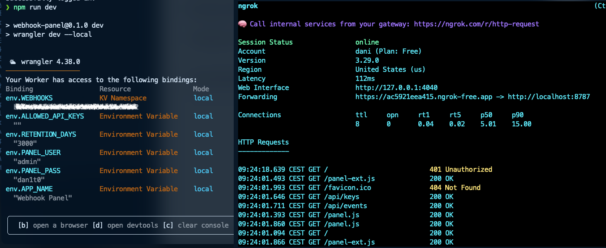

# Webhook Catcher Workers


🎯 Modern webhook receiver and dashboard built on Cloudflare Workers + KV. Features real-time UI, export capabilities, and OPSEC-friendly on-premises deployment options. Perfect for red teams, penetration testing, and secure webhook management.

## Descripción

Panel para recibir, visualizar, buscar, exportar y eliminar payloads de webhooks por proyecto (opcionalmente por `key`) usando Cloudflare Workers + KV. Incluye autenticación Basic para el panel y operaciones sensibles.

## Funcionalidades

- Recepción de webhooks con o sin `key` (los sin `key` se etiquetan como `NO-KEY`).
- Panel con UI moderna: búsqueda, auto-refresh, selección múltiple y borrado, exportación JSON/CSV, selector de `key` detectadas.
- Paginación preparada en API (`cursor`, `listComplete`).
- Soporte para temas claro/oscuro.
- Interfaz responsive y moderna sin dependencias externas.

## Endpoints

### `POST /webhook`
- Recibe JSON plano (pares clave-valor, sin objetos/arrays anidados) y lo guarda.
- Opcional: header `key: <PROJECT_KEY>`. Si no se envía, se guarda como `NO-KEY`.
- Compatibilidad temporal: `api_key` (query) y `X-API-Key` (header).

### `GET /panel?limit=50`
- Panel HTML. Protegido con Basic Auth (`PANEL_USER`/`PANEL_PASS`).
- Carga las keys disponibles y permite elegir `NO-KEY` o una `key` concreta.

### `GET /api/events?limit=50&cursor=...&key=...`
- Devuelve `{ events, cursor, listComplete }`. Sin Basic Auth (pensado para el front del panel).
- Si `key` se omite/vacía, lista `NO-KEY`.

### `GET /api/keys`
- Devuelve `{ keys: [ ... ] }` con las keys detectadas en KV (el panel añade `NO-KEY`).

### `DELETE /api/events`
- Body: `{ "key": "<KEY|'' para NO-KEY>", "ids": ["<eventId>", ...] }`
- Borra en batch (límite interno 500). Protegido con Basic Auth.

## Configuración

### 1. Instalación de dependencias
`npm install`

### 2. Configuración de KV Namespaces
```bash
# Crear namespaces KV
npx wrangler kv namespace create WEBHOOKS
npx wrangler kv namespace create WEBHOOKS --preview
```

Copia los IDs generados en `wrangler.toml` (reemplaza `YOUR_KV_NAMESPACE_ID` y `YOUR_KV_PREVIEW_NAMESPACE_ID`).

### 3. Configuración de variables

Edita `wrangler.toml` con tus valores:

- `ALLOWED_API_KEYS`: lista separada por comas. Vacío = aceptar cualquier `key` (incluida `NO-KEY`).
- `RETENTION_DAYS`: días de retención por TTL en KV (por defecto `30`).
- `PANEL_USER`, `PANEL_PASS`: credenciales para el panel y `DELETE /api/events`.
- `APP_NAME`: nombre de la aplicación mostrado en el panel.

## Desarrollo

`npm run dev`

Panel local: `http://localhost:8787/panel` (usuario/contraseña configurados en `wrangler.toml`).

## Despliegue

Requisitos previos: `npx wrangler login` y cuenta/zona configuradas en Cloudflare.

### A) Producción sin dominio propio (workers.dev)

1. Asegúrate de tener `workers_dev = true` en `wrangler.toml` (ya está por defecto).
2. Despliega: `npm run deploy`
3. La salida mostrará la URL `*.workers.dev`, por ejemplo: `https://webhook-panel.<tu-subdominio>.workers.dev/panel`.

### B) Producción con subdominio propio

1. En Cloudflare DNS, crea el registro para tu subdominio y márcalo como Proxied (nube naranja).
2. Añade una ruta en `wrangler.toml`:

   ```toml
   routes = [
     { pattern = "webhook.tudominio.com/*", zone_name = "tudominio.com" }
   ]
   ```

3. Despliega: `npm run deploy`
4. Accede al panel en `https://webhook.tudominio.com/panel`.

## OPSEC (Seguridad Operacional)

Para proyectos que requieran **alta seguridad operacional** como red teams, penetration testing, o cualquier escenario donde sea crítico proteger los datos del cliente y evitar exposición en servicios cloud públicos, es posible ejecutar este panel **on-premises**.

### Despliegue Local con Proxy Reverso

#### Opción 1: Ngrok (Desarrollo/POC)

Para pruebas rápidas o demostraciones:

```bash
# Ejecutar el panel localmente
npm run dev

# En otra terminal, exponer con ngrok
ngrok http http://localhost:8787
```



Ngrok te proporcionará una URL pública temporal que rediriges al panel local, manteniendo todos los datos en tu infraestructura.

#### Opción 2: Caddy (Producción Recomendada)

Para entornos de producción, se recomienda usar **Caddy** u otro proxy reverso profesional:

```bash
# Instalar Caddy
curl -1sLf 'https://dl.cloudsmith.io/public/caddy/stable/setup.deb.sh' | sudo bash
sudo apt install caddy
```

**Configuración básica (sin proxy, IP expuesta):**

```bash
# Configurar Caddyfile - SIN tls internal para usar Let's Encrypt
echo "webhook.tudominio-interno.com {
    reverse_proxy localhost:8787
}" | sudo tee /etc/caddy/Caddyfile
```

**Configuración OPSEC (con Cloudflare como proxy - RECOMENDADO):**

```bash
# Configurar Caddyfile - CON tls internal (requiere Cloudflare como proxy)
echo "webhook.tudominio-interno.com {
    reverse_proxy localhost:8787
    tls internal
}" | sudo tee /etc/caddy/Caddyfile
```

**⚠️ Importante para OPSEC:**

- **`tls internal` (MÁS OPSEC)**: Caddy debe estar **detrás de Cloudflare** como proxy. Ventajas: IP real oculta, protección DDoS, WAF integrado, dificulta fingerprinting de infraestructura.
- **Sin `tls internal` (MENOS OPSEC)**: Caddy generará certificados de **Let's Encrypt** directamente. Desventajas: IP del servidor expuesta, sin protección proxy, dominio registrado en Certificate Transparency logs públicos.

```bash
# Iniciar Caddy
sudo systemctl start caddy
sudo systemctl enable caddy
```

### Ventajas del Despliegue On-Premises

- **Control total de datos**: Los webhooks nunca salen de tu infraestructura
- **Sin dependencias cloud**: No requiere cuentas Cloudflare ni servicios externos
- **Auditoría completa**: Logs y trazabilidad total en tu red
- **Red Team friendly**: Perfecto para proyectos donde no puedes usar servicios públicos

## Ejemplos de Uso

### Enviar webhook con key

```bash
curl -X POST "http://localhost:8787/webhook" \
  -H "Content-Type: application/json" \
  -H "key: demo" \
  -d '{"orderId":"123","status":"paid"}'
```

### Enviar webhook sin key

```bash
curl -X POST "http://localhost:8787/webhook" \
  -H "Content-Type: application/json" \
  -d '{"ping":"pong"}'
```

## Seguridad

- **Cambiar credenciales**: Modifica `PANEL_USER` y `PANEL_PASS` antes de ir a producción.
- **Allowlist de API keys**: Configura `ALLOWED_API_KEYS` para restringir las keys válidas.
- **Basic Auth**: El panel está protegido con autenticación básica.
- **CORS**: Configurado para permitir webhooks desde cualquier origen.

## Gestión y Mantenimiento

### Exportar datos

- **JSON**: Botón "Export JSON" en el panel
- **CSV**: Botón "Export CSV" en el panel

### Eliminar eventos

- Selección múltiple con checkboxes
- Botón "Delete selected" para borrado en batch
- Límite de 500 eventos por operación

### Monitoreo

- Auto-refresh configurable en el panel. **(Ten cuidado con la cuota gratuita si estas ejecutandolo en Cloudflare)**
- Búsqueda y filtrado en tiempo real
- Contador de eventos visible

## Limpieza y Desinstalación

### Eliminar deployment de Cloudflare

#### Workers.dev (sin dominio propio)

`npx wrangler delete`

#### Con dominio propio

1. Comentar rutas en `wrangler.toml`:

   ```toml
   # routes = [
   #   { pattern = "webhook.tudominio.com/*", zone_name = "tudominio.com" }
   # ]
   ```

2. Redesplegar: `npm run deploy`

3. O eliminar completamente: `npx wrangler delete`

### Eliminar KV Namespaces (opcional)

# Sustituir por tus IDs reales de wrangler.toml

```toml
npx wrangler kv:namespace delete --namespace-id <WEBHOOKS_id>
npx wrangler kv:namespace delete --namespace-id <WEBHOOKS_preview_id>
```

### Limpiar DNS

- Eliminar registros DNS desde el panel de Cloudflare si usaste dominio propio

## Estructura del Proyecto

```
webhook-panel/
├── src/
│   └── index.ts          # Lógica principal del Worker
├── package.json          # Dependencias y scripts
├── wrangler.toml        # Configuración de Cloudflare Workers
├── wrangler.toml.sample # Plantilla de configuración
├── tsconfig.json        # Configuración TypeScript
├── .gitignore          # Archivos ignorados por Git
└── README.md           # Esta documentación
```

## Agradecimientos

Gracias a [0xh3l1x](https://x.com/cgomezz_23) Por ser el conejillo de indias y sujerir alguna mejora ademas de afixearl algun bug.

## Licencia

Este proyecto está bajo la licencia MIT. Ver archivo `LICENSE` para más detalles.
